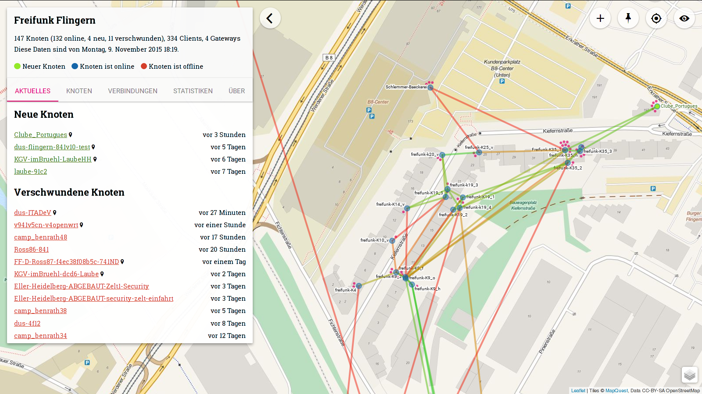
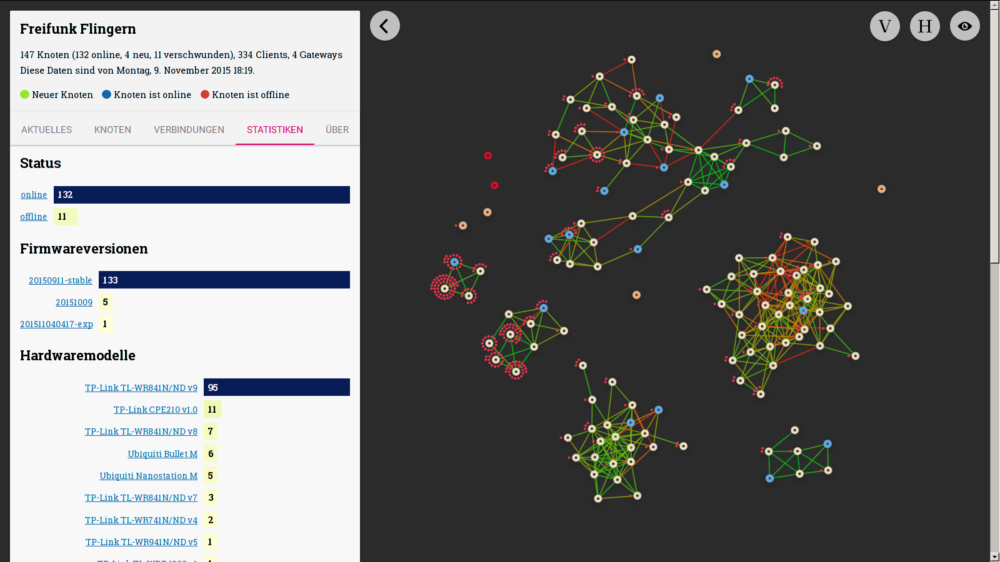
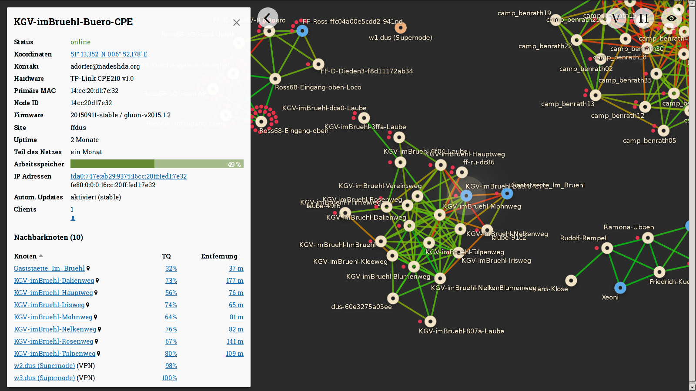

# Meshviewer

Meshviewer is a frontend for
[ffmap-backend](https://github.com/ffnord/ffmap-backend).

[Changelog](CHANGELOG.md)

This is a fork of the original Meshviewer project, which is not maintained by its creator anymore. The aim is to bring some organization into the development of Meshviewer after the discontinuation of the original project. 
There is no stable release cycle at the moment. Please use the master branch and update your installation regularly. 

# Screenshots

# Communities providing an installation of this fork:

- [Freifunk Düsseldorf-Flingern](http://map.ffdus.de/)
- [Freifunk im Ennepe-Ruhr-Kreis](http://map.en.freifunk.ruhr/v4/)
- [Freifunk gl.wupper](http://map.gl.wupper.ffrl.de/v4/)

# Configuration

Copy `config.json.example` to `build/config.json` and change it to match your community.

## dataPath (array / string)

`dataPath` must contain one or more strings pointing to a directory containing
`nodes.json` and `graph.json` (both are generated by
[ffmap-backend](https://github.com/ffnord/ffmap-backend)). Don't forget the
trailing slash! Data may be served from a different domain with [CORS enabled].
Also, GZip will greatly reduce bandwidth consumption.

## siteName (string)

Change this to match your communities' name. It will be used in various places.

## mapSigmaScale (float)

This affects the initial scale of the map. Greater values will show a larger
area. Values like 1.0 and 0.5 might be good choices.

## showContact (bool)

Setting this to `false` will hide contact information for nodes.

## maxAge (integer)

Nodes being online for less than maxAge days are considered "new". Likewise,
nodes being offline for less than than maxAge days are considered "lost".

## mapLayers (List)

A list of objects describing map layers. Each object has at least `name`
property and optionally `url` and `config` properties. If no `url` is supplied
`name` is assumed to name a
[Leaflet-provider](http://leaflet-extras.github.io/leaflet-providers/preview/).

## nodeInfos (array, optional)

This option allows to show client statistics depending on following case-sensitive parameters:

- `name` caption of statistics segment in infobox
- `href` absolute or relative URL to statistics image
- `thumbnail` absolute or relative URL to thumbnail image,
  can be the same like `href`
- `caption` is shown, if `thumbnail` is not present (no thumbnail in infobox)

To insert current node-id in either `href`, `thumbnail` or `caption`
you can use the case-sensitive template string `{NODE_ID}`.

Examples for `nodeInfos`:

    "nodeInfos": [
      { "name": "Clientstatistik",
        "href": "nodes/{NODE_ID}.png",
        "thumbnail": "nodes/{NODE_ID}.png",
        "caption": "Knoten {NODE_ID}"
      },
      { "name": "Uptime",
        "href": "nodes_uptime/{NODE_ID}.png",
        "thumbnail": "nodes_uptime/{NODE_ID}.png",
        "caption": "Knoten {NODE_ID}"
      }
    ]

In order to have statistics images available, you have to run the backend with parameter `--with-rrd` or generate them in other ways.

## globalInfos (array, optional)

This option allows to show global statistics on statistics page depending on following case-sensitive parameters:

- `name` caption of statistics segment in infobox
- `href` absolute or relative URL to statistics image
- `thumbnail` absolute or relative URL to thumbnail image,
  can be the same like `href`
- `caption` is shown, if `thumbnail` is not present (no thumbnail in infobox)

In contrast to `nodeInfos` there is no template substitution in  `href`, `thumbnail` or `caption`.

Examples for `globalInfos`:

    "globalInfos": [
      { "name": "Wochenstatistik",
        "href": "nodes/globalGraph.png",
        "thumbnail": "nodes/globalGraph.png",
        "caption": "Bild mit Wochenstatistik"
      },
      { "name": "Jahresstatistik",
        "href": "nodes/globalGraph52.png",
        "thumbnail": "nodes/globalGraph52.png",
        "caption": "Bild mit Jahresstatistik"
      }
    ]

In order to have global statistics available, you have to run the backend with parameter `--with-rrd` (this only creates globalGraph.png) or generate them in other ways.

## Colors and Radius for Nodes

In `lib/map.js` you can change the colors and radius for nodes in different states:

- iconNew: Nodes that are online for less than maxAge days (default: green, radius: 6)
- iconOnline: online for more than `maxAge` days (default blue, radius: 6)
- iconAlert: nodes offline less than 8 Hours (default: blinking red, radius: 5)
- iconLost: nodes being offline for less than than `maxAge` days (default: grey, radius: 5)
- iconOffline: offline for more than `maxAge` days up to the maximum prune time of the backend (default: grey, radius: 3)

## siteNames (array, optional)

In this array name definitions for site statistics and node info can be saved. This requires one object for each site code. This object must contain:

- `site` the site code
- `name` the defined written name for this site code

If neither `siteNames` nor `showSites` are set, site statistics and node info won't be displayed

Example for `siteNames`:

    "siteNames": [
      { "site": "ffhl", "name": "Lübeck" },
      { "site": "ffgt", "name": "Gothamcity" },
      { "site": "ffal", "name": "Atlantis" }
    ]

# Building a minimized version

Consider using a [precompiled tarball](http://petabyteboy.de:8090/job/plumpudding-meshviewer/lastSuccessfulBuild/artifact/build.zip) of the latest and greatest master commit

## Build dependencies

- npm
- bower
- grunt-cli
- Sass (>= 3.2)

## Installing dependencies

Install npm and Sass with your package-manager. On Debian-like systems run:

    sudo apt-get install git npm nodejs-legacy ruby-sass

or if you have bundler you can install ruby-sass simply via `bundle install`

Execute these commands on your server as a normal user to prepare the dependencies:

    git clone https://github.com/tcatm/meshviewer.git
    cd meshviewer
    npm install
    npm install grunt-cli

## Building

Just run the following command from the meshviewer directory:

    node_modules/.bin/grunt

This will generate `build/` containing all required files.

# Deploy

Place your config.json in the `build/` directory. Now just copy `build/` into your servers document-home (e.g. /var/www/meshviewer/ or /srv/http/meshviewer/).

# Contribution Policy

Contributions are generally welcome. Please make sure your request meets all the following criteria:

- The changes don't drastically decrease performance and are implemented with weak clients (such as smartphones) in mind.
- It is impossible to archieve the same result without the changes. Simplifications of existing features are not likely to be accepted.
- The code is not overcomplicated and uses a style similar to other parts of the codebase.

If you really want a feature don't be afraid to ask. We will make a decision for the individual case or find a reasonable compromise.

If you modify the source be sure to update the links in lib/about.js to match your modified version. 

[CORS enabled]: http://enable-cors.org/server.html
